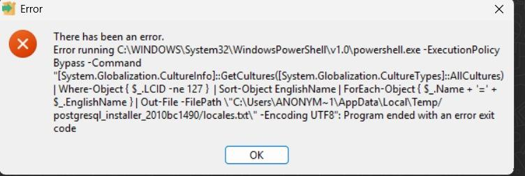
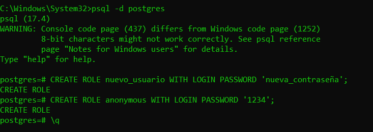
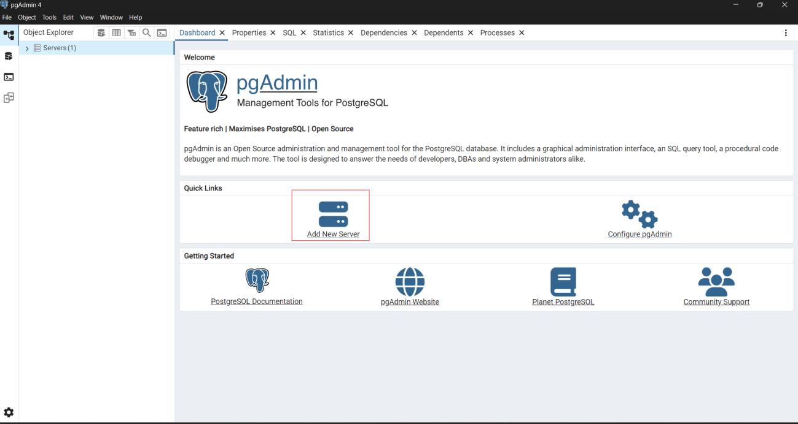
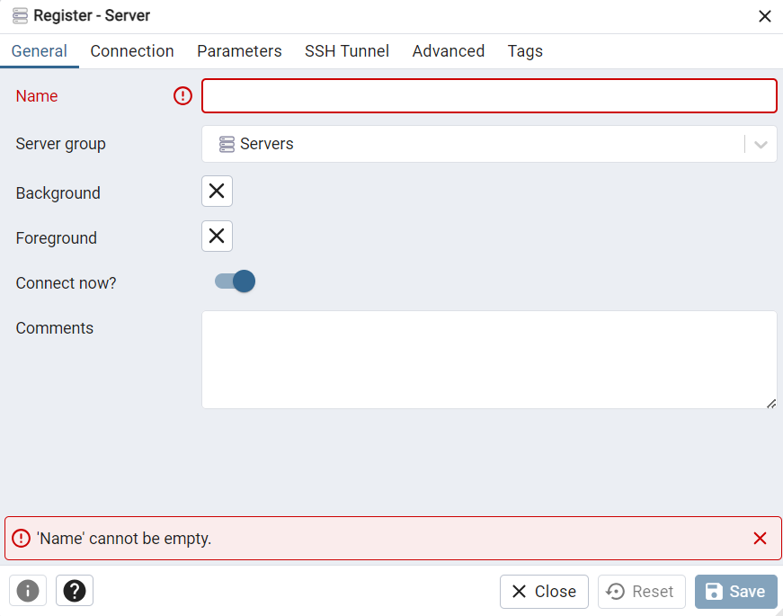
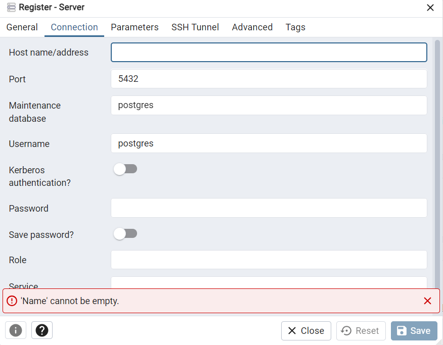
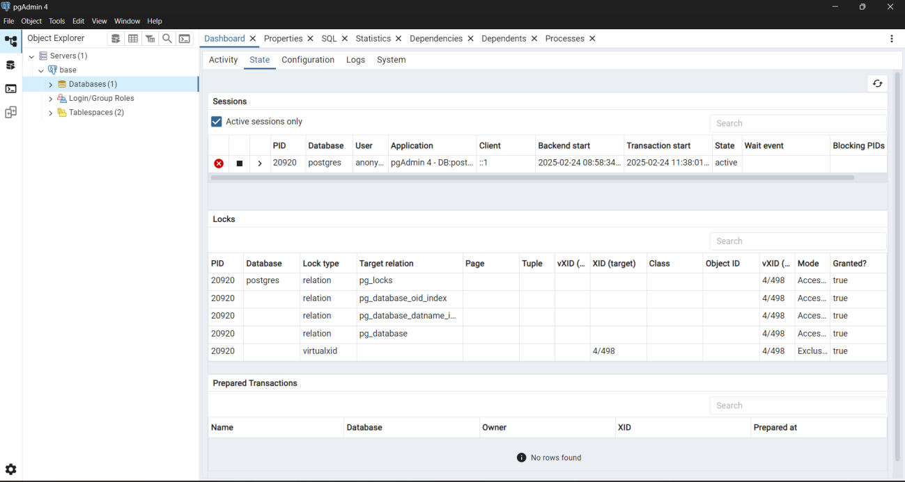
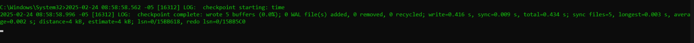

# PostgreSQL Installation Error Fix (Step-by-Step Guide)

## ⚠️ The Error

This is the error I encountered:



## 🧩 Overview
I tried multiple ways to resolve this PostgreSQL installation error, but none worked.  
However, I was finally able to **successfully install PostgreSQL using its ZIP version**, available on the official website.

---

## 📦 Download the ZIP Version
You can download it directly from the official page:  
👉 [https://www.enterprisedb.com/download-postgresql-binaries](https://www.enterprisedb.com/download-postgresql-binaries)

Once downloaded:
1. Extract the ZIP file into a folder of your choice (`Downloads`, `Documents`, or any preferred location).
2. Inside the extracted folder, locate the **`bin`** directory.
3. Add this `bin` path to your **system environment variables** (Path).

---

## 🗂️ Initialize the Database Cluster

1. Create a folder to serve as your **database cluster directory** (name it however you want, e.g., `pg_data`).
2. Open **Command Prompt (as Administrator)** and run the following command to initialize the cluster:

```bash
initdb -D /path/to/your/database
```


## 🚀 Start the PostgreSQL Server

To start the server, run:
```bash
pg_ctl -D "path/to/your/database" start
```

## To check whether your server is running:
```bash
pg_ctl -D "path/to/your/database" status
```

## 💾 Connect to PostgreSQL (Default User)

Connect to the database without specifying a user:

```bash
psql -d postgres
```

## 👤 Create a New User Role

Once inside the PostgreSQL console, create a new user with login and password:

```bash
CREATE ROLE new_user WITH LOGIN PASSWORD 'new_password';
```
Example:
If I set 'anonymous' as my user and '1234' as my password, it would look like this:



Exit the PostgreSQL console:
```bash
\q
```


Then reconnect using the new credentials:
```bash
psql -U new_user -d postgres
```


## 🖥️ Install pgAdmin (Optional GUI)

To manage PostgreSQL with a graphical interface, install pgAdmin 4 from the official website:
👉 https://www.pgadmin.org/download/

After installing:

Open pgAdmin 4.

Add a new server.

You will see a pop-up like this:






Name: Choose any name you prefer.

Connection → Host/Address: localhost

Username: Your created user (e.g., new_user)

Password: The password you set earlier.


In the 'Host/Address' field, enter the localhost. For 'Username' and 'Password', use the 
credentials you created earlier in the command prompt. 
 If everything is configured properly, you will see the following output in pgAdmin and 
your command prompt.





## ⚙️ Extra: Grant Privileges to Your User
```bash
GRANT CREATE ON SCHEMA public TO your_username;
GRANT CONNECT ON DATABASE your_db TO your_username;
GRANT ALL PRIVILEGES ON ALL TABLES IN SCHEMA public TO your_username;
ALTER DEFAULT PRIVILEGES IN SCHEMA public GRANT ALL PRIVILEGES ON TABLES TO your_username;
GRANT USAGE, SELECT ON ALL SEQUENCES IN SCHEMA public TO your_username;
GRANT EXECUTE ON ALL FUNCTIONS IN SCHEMA public TO your_username;
ALTER ROLE your_username CREATEDB;
ALTER ROLE your_username SUPERUSER;
```


##  Conclusion

This method provides a clean installation of PostgreSQL without using the installer, avoiding many common setup errors.
You can now manage your databases through psql or pgAdmin 4 with full privileges.
